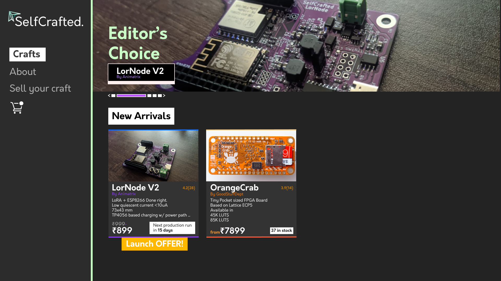

## TODO:
- [ ] Account creation view design (My orders, Cart)
- [ ] Sell your Craft page design
- [ ] Contact page design
- [ ] Main page add automatic carousel view for image
- [ ] Main page carousel indicator arrow loop instead of end to end
- [ ] Product page UI implementation
- [x] ~~Main page basic UI implementation~~
- [x] ~~Product page design~~
- [x] ~~Main page design~~

## Setup

```bash
npm install #install both dependencies and devDependencies
npm run dev #will init a local server hosting this site
```

## Target


Routing
-------

Main types
-> app.html, app.d.ts
-> +page.svelte, +page.ts, +page.server.ts
-> +error.svelte, +error.ts
-> +layout.svelte, +layout.ts, +layout.server.ts
-> +server.ts

=> /app.html is the main body of the entire app and /app.d.ts contains any scripting related to this global element. It is generally not necessary to make changes here.
=> when any route (/X/Y) is rendered a request goes to (/X/Y/+page.svelte) which runs (/X/Y/+page.ts) alongside as the elements are loaded into /app.html.
=> page.ts can export values that also consider the pages behavior like
    => export const prerender,ssr,csr = true;
    => <https://kit.svelte.dev/docs/page-options>

=> +page.server.ts is the same as +page.ts except it runs in the server and has access to server variables like API keys.
=> +error.svelte that handles route specific error page navigation
=> +layout.svelte, unlike pages that are fully replaced on navigation, layout files if defined are rendered as a global element and will persist through navigations (like appbars)
    => \<slot></slot> elements are used within layout svelte files to define the "page area"
    => data from +layout.ts load functions is also available to all child pages.

=> +server.ts for custom route+(HTTP Verb)/response handling, can be used for creating API's
    see <https://kit.svelte.dev/docs/routing#server-content-negotiation>


Requires (Tailwind, skeleton)
-----------------------------
npm i -D @skeletonlabs/skeleton @skeletonlabs/tw-plugin
npx svelte-add@latest tailwindcss
npm install